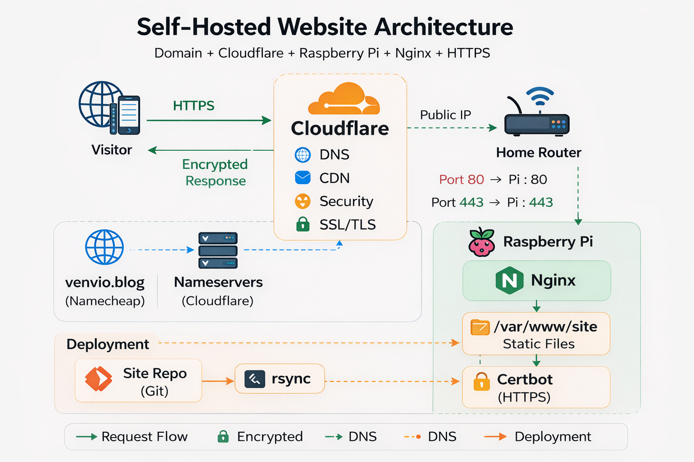

# Self-Hosting a Static Website
This README is describing the configuration and deployment of my self-hosted website, publicly available at [https://venvio.blog](https://venvio.blog)
### Nginx + Cloudflare + Raspberry Pi + HTTPS

> Static website self-hosted on a Raspberry Pi behind Cloudflare.

------------------------------------------------------------------------



------------------------------------------------------------------------

## Architecture Overview

High level request flow:

    Visitor
       ↓
    Cloudflare DNS
       ↓
    Cloudflare proxy / CDN
       ↓
    Home router (public IP)
       ↓
    Port forwarding
       ↓
    Raspberry Pi
       ↓
    nginx
       ↓
    Static website files

------------------------------------------------------------------------

## 1. Domain Registration

Domain  `venvio.blog` was purchased from **Namecheap**.

Namecheap acts as the **domain registrar**, while DNS resolution is
delegated to **Cloudflare**.

------------------------------------------------------------------------

## 2. Cloudflare

Cloudflare was used as the authoritative DNS provider to mask home IP address.

------------------------------------------------------------------------

## 3. Serving Content

The website is served from a **Raspberry Pi running nginx**.

### Install nginx

``` bash
sudo apt update
sudo apt install nginx
```

### Basic nginx configuration

Config file:

    /etc/nginx/sites-available/default

Example server block:

    server {
        listen 80;
        root /var/www/site;
        index index.html;
    }

Static files are served from:

    /var/www/site

------------------------------------------------------------------------

## 4. Deployment

The website source repository lives outside the web root. Deployment copies files into the nginx directory using `rsync`.

Example:

``` bash
rsync -av ~/site-repo/ /var/www/site/
```

------------------------------------------------------------------------

## 5. Router Port Forwarding

Because the server is inside a home network, the router must forward
traffic.

Forward the following ports:

    Port: 80  → Raspberry Pi: 80
    Port: 443 → Raspberry Pi: 443

------------------------------------------------------------------------

## 6. HTTPS with Let's Encrypt (Certbot)

Certificates are issued automatically using **Certbot**.

Install:

``` bash
sudo apt install certbot python3-certbot-nginx
```

Generate certificates:

``` bash
sudo certbot --nginx
```
------------------------------------------------------------------------

## 7. Cloudflare SSL Configuration

Cloudflare SSL mode is set to:

    Full

Connection path:

    Visitor → HTTPS → Cloudflare → HTTPS → Raspberry Pi

Traffic remains encrypted end-to-end.
